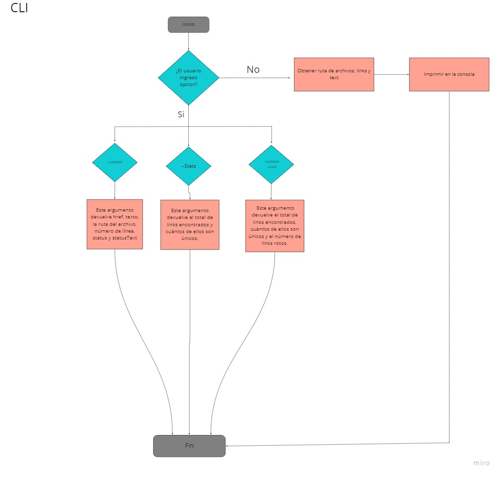
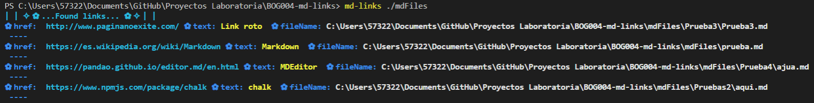
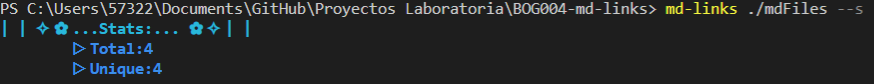
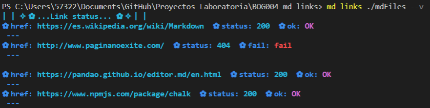
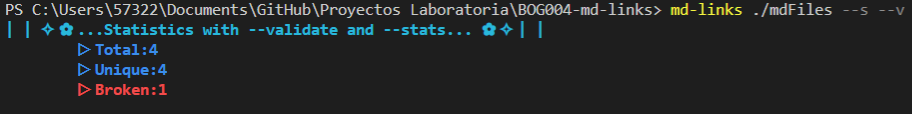

# ✨Markdown Links✨

## Index

* [1. Project summary](#1-project-summary)
* [2. Flowchart](#2-flowchart)
* [3. Installation and use of the library](#3-installation-and-use-of-the-library)
* [4. Learning objectives](#4-learning-objectives)

***

### 1. Project summary

This library was designed to read files with extension ".md" (markdown) and extract all links, within the directory path provided by the user. In order that the user can visualize which link is still up or which ones are down. In this project I made use of two libraries which are chalk and fetch.

***

### 2. Flowchart

The idea of this flowchart was to organize for the creation of the project, I will leave the img so that you can observe the two diagrams. 

## Api


## CLI



***

### 3. Installation and use of the library

To install the package, execute the following command:
```javascript
npm install md-links-kdbaron
```

This application can be executed through the terminal with the following structure:

Only with the path:  ```md-links <PATH>```


Path with stats option: ```md-links <PATH> --stats``` or ```md-links <PATH> --s```


Path with validation option: ```md-links <PATH> --validate``` or ```md-links <PATH> --v```


Path with validation option and statistics: ```md-links <PATH> --validate --stats``` or ```md-links <PATH> --stats --validate```


***

### 4. Learning objectives

Reflect and then mark the objectives that you have come to understand and apply in your project. Think about that when deciding your work strategy.

### JavaScript

- [x] **Differentiate between primitive and non-primitive data types**

- [x] **Arrays (arreglos)**

- [x] **Objets (key, value)**

- [x] **Use of conditionals (if-else, switch, ternary operator, boolean logic)**

- [x] **Functions (params, args, return)**

- [x] **Recursion or recursion**

- [x] **CommonJS modules**

- [x] **Differentiate between expressions and statements**

- [x] **Callbacks**

- [x] **Promises**

- [x] **Unit tests**

- [] **Asynchronous tests**

- [x] **Use of mocks and spies**

- [x] **Compatibility tests in multiple execution environments**

- [x] **Use of linter (ESLINT)**

- [x] **Use of descriptive identifiers (Nomenclature and Semantics)**

### Node.js

- [x] **Install and use modules with npm**

- [x] **Package.json settings**

- [x] **Configuration of npm-scripts**

- [x] **process (env, argv, stdin-stdout-stderr, exit-code)**

- [x] **File system (fs, path)**

### Version Control (Git and GitHub)

- [x] **Git: Installation and configuration**

- [x] **Git: Version control with git (init, clone, add, commit, status, push, pull, remote)**

- [x] **Git: Integration of changes between branches (branch, checkout, fetch, merge, reset, rebase, tag)**

- [x] **GitHub: Account creation and repos, configuration of SSH keys**

- [x] **GitHub: Deploy with GitHub Pages**

- [x] **GitHub: Collaboration on Github (branches | forks | pull requests | code review | tags)**

- [x] **GitHub: Organization on Github (projects | issues | labels | milestones | releases)**

### HTTP

- [x] **Query or request (request) and response (response).**

- [x] **HTTP status codes**

***

#### ✨🌸Create by Karen Baron🌸✨
```
        ⠀⠀⠀⠀⠀⠀⠀⢀⣤⠖⠛⠉⠉⠛⠶⣄⡤⠞⠻⠫⠙⠳⢤⡀⠀⠀⠀⠀
        ⠀⠀⠀⠀⠀⠀⢠⠟⠁⠀⠀⠀⠀⠀⠀⠈⠀⢰⡆⠀⠀⠐⡄⠻⡄⠀⠀⠀
        ⠀⠀⠀⠀⠀⠀⡾⠀⠀⠀⠀⠀⠀⠀⠀⠀⠀⠀⠛⠦⠤⣤⣇⢀⢷⠀⠀⠀
        ⠀⠀⠀⠀⠀⠀⢳⠀⠀⠀⠀⠀⠀⠀⠀⠀⠀⠀⠀⠀⠀⣿⡀⢈⡼⠀⠀⠀
        ⠀⠀⠀⠀⠀⠀⠘⣆⢰⡀⠀⠀⠀⠀⠀⠀⠀⠀⠀⠀⠀⠀⠁⣼⠃⠀⠀⠀
        ⠀⠀⠀⠀⠀⠀⠀⠙⣎⢳⣄⠀⠀⠀⠀⠀⠀⠀⠀⠀⠀⢀⡾⠃⠀⠀⠀⠀
        ⠀⠀⠀⠀⠀⠀⠀⠀⠈⢳⣝⠳⣄⡀⠀⠀⠀⠀⠀⢀⡴⠟⠁⠀⠀⠀⠀⠀
        ⠀⠀⠀⠀⠀⠀⠀⠀⠀⠀⠈⠳⢮⣉⣒⣖⣠⠴⠚⠉⠀⠀⠀⠀⠀⠀⠀⠀
        ⠀⠀⠀⣀⣴⠶⠶⢦⣀⠀⠀⠀⠀⠀⠉⠁⠀⠀⠀⠀⢀⣠⣤⣤⣀⠀⠀⠀
        ⠀⢀⡾⠋⠀⠀⠀⠀⠉⠧⠶⠒⠛⠛⠛⠛⠓⠲⢤⣴⡟⠅⠀⠀⠈⠙⣦⠀
        ⠀⣾⠁⠀⠀⠀⠀⠀⠀⠀⣠⡄⠀⠀⠀⣀⠀⠀⠀⠈⠀⠀⠀⠀⠀⠀⠸⣇
        ⠀⣿⡀⠀⠀⠀⠀⠀⢀⡟⢁⣿⠀⢠⠎⢙⡇⠀⠀⠀⠀⠀⠀⠀⠀⠀⠀⣽
        ⠀⠈⢻⡇⠀⠀⠀⠀⣾⣧⣾⡃⠀⣾⣦⣾⠇⠀⠀⠀⠀⠀⠀⠀⠰⠀⣼⠇
        ⠀⢰⡟⠀⡤⠴⠦⣬⣿⣿⡏⠀⢰⣿⣿⡿⢀⡄⠤⣀⡀⠀⠀⠀⠰⢿⡁⠀
        ⠀⡞⠀⢸⣇⣄⣤⡏⠙⠛⢁⣴⡈⠻⠿⠃⢚⡀⠀⣨⣿⠀⠀⠀⠀⢸⡇⠀
        ⢰⡇⠀⠀⠈⠉⠁⠀⠀⠀⠀⠙⠁⠀⠀⠀⠈⠓⠲⠟⠋⠀⠀⠀⠀⢀⡇⠀
        ⠈⣧⠀⠀⠀⠀⠀⠀⠀⠀⠀⠀⠀⠀⠀⠀⠀⠀⠀⠀⠀⠀⠀⠀⠀⢸⠇⠀
        ⠀⢹⡇⠀⠀⠀⠀⠀⠀⠀⠀⠀⠀⠀⠀⠀⠀⠀⠀⠀⠀⠀⠀⠀⠀⣾⡄⠀
        ⠀⠀⠻⣄⠀⠀⠀⠀⠀⠀⠀⠀⠀⠀⠀⠀⠀⠀⠀⠀⠀⠀⠀⠀⣽⠋⣷⠀
        ⠀⠀⢰⣿⣦⡀⠀⠀⠀⠀⠀⠀⠀⠀⠀⠀⠀⠀⠀⠀⠀⠀⣠⡾⠃⠀⣿⡇
        ⠀⠀⢸⡯⠈⠛⢶⣄⡀⠀⠀⠀⠀⠀⠀⠀⠀⠀⠀⣀⣤⠾⠋⠂⠀⠀⣿⠃
        ⠀⠀⠈⣷⣄⡛⢠⣈⠉⠛⠶⢶⣶⠶⠶⢶⡶⠾⠛⠉⠀⠀⠀⠁⢠⣠⡏⠀
        ⠀⠀⠀⠈⠳⣅⡺⠟⠀⣀⡶⠟⠁⠀⠀⠘⢷⡄⠀⠛⠻⠦⡄⢀⣒⡿⠀⠀
        ⠀⠀⠀⠀⠀⠈⠉⠉⠛⠁⠀⠀⠀⠀⠒⠂⠀⠙⠶⢬⣀⣀⣤⡶⠟⠁⠀⠀
```